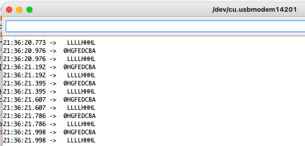

# README

This git repository contains an Arduino sketch which is used to test the 8-Bit parallel in/serial out shift register IC 74HC165.

The specific use case and pinout has been intended for for testing the ["splitflap classic controller"](https://github.com/scottbez1/splitflap) shield in combination with the magnetic switches (hall-effect sensors). In the code it is used in conjunction with an Arduino Leonardo - but it shouldn't be difficult to adapt for other Arduino platforms.

Holding magnets near the sensors should toggle the output from high to low (there are pull-up resistors, the switches connect to ground when closed):

